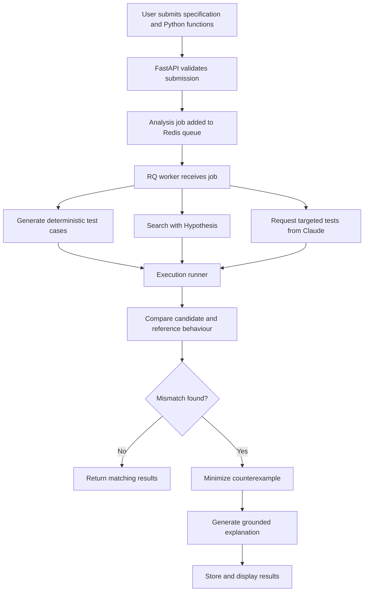

# AI Code Breaker

> An AI-assisted differential testing platform that generates adversarial test cases, compares Python implementations, and explains confirmed bugs.

[View Demo](YOUR_DEMO_LINK) · [Watch Demo Video](YOUR_VIDEO_LINK) · [Report a Bug](https://github.com/YOUR_USERNAME/ai-code-breaker/issues)


## Table of Contents

- [About the Project](#about-the-project)
- [How It Works](#how-it-works)
- [Key Features](#key-features)
- [Screenshots](#screenshots)
- [Technologies Used](#technologies-used)
- [Architecture](#architecture)
- [Getting Started](#getting-started)
- [Using the Application](#using-the-application)
- [Testing](#testing)
- [Project Approach](#project-approach)
- [Security and Limitations](#security-and-limitations)
- [Project Status](#project-status)
- [Future Improvements](#future-improvements)
- [Credits](#credits)
- [License](#license)

## About the Project

AI-generated code can appear correct while still failing on unusual inputs, boundary cases, duplicate values, or incorrect exception handling.

AI Code Breaker helps uncover these problems by comparing two Python implementations:

- A **candidate implementation** that may contain a bug.
- A **reference implementation** that represents the expected behaviour.

The system generates test inputs, executes both implementations, compares their observed behaviour, and reports the confirmed differences.

AI is used to propose targeted test cases and explain verified failures. It is **not** used as the final judge of correctness. Candidate and reference behaviour is determined through real code execution.

### Example

Candidate implementation:

```python
def second_largest(values):
    return sorted(values)[-2]
```

Reference implementation:

```python
def second_largest(values):
    unique = sorted(set(values))

    if len(unique) < 2:
        raise ValueError("Need at least two distinct values")

    return unique[-2]
```

Counterexample found:

```python
[5, 5]
```

Observed behaviour:

```text
Candidate: returned 5
Reference: raised ValueError
Result: confirmed mismatch
```

## How It Works



The core analysis pipeline is:

1. Validate the function name, source code, specification, and manual inputs.
2. Generate deterministic edge cases.
3. Optionally use Hypothesis to search a wider input space.
4. Optionally ask Claude to propose targeted test inputs.
5. Execute the candidate and reference implementations.
6. Normalize returned values, exceptions, timeouts, and execution errors.
7. Compare the two behaviours.
8. Minimize confirmed counterexamples where possible.
9. Generate an explanation based on verified execution results.
10. Save the completed analysis for later viewing.

## Key Features

### Differential testing

Runs candidate and reference implementations on the same inputs and detects differences in:

- Returned values
- Exception types
- Timeout behaviour
- Execution status

### Deterministic edge-case generation

Automatically tests cases such as:

- Empty lists
- Single-element lists
- Duplicate values
- All-negative values
- Sorted and reverse-sorted inputs
- Boundary-style integers
- Repeated patterns

### Property-based testing

Uses Hypothesis to explore a larger input space and search for counterexamples that manually written tests may miss.

### AI-targeted test generation

Claude analyzes the specification and candidate implementation to propose inputs likely to expose a bug.

Claude only proposes inputs. Every test is independently executed before it can be classified as a match or mismatch.

### Counterexample minimization

Attempts to reduce a failing input to a smaller example that is easier to understand and reproduce.

### Grounded bug explanations

After a mismatch is confirmed, the application can explain:

- The failing input
- Candidate behaviour
- Reference behaviour
- Likely root cause
- Relevant source-code lines
- A possible high-level fix

AI-generated commentary is displayed separately from verified execution results.

### Persistent analysis results

Completed analyses are stored in PostgreSQL and can be reopened through their result pages.

### Background job processing

Longer analyses run through Redis and RQ workers instead of blocking the API request.

## Screenshots

### Submission page


### Confirmed counterexample


### Test results


### AI explanation


> Add real screenshots to `docs/images/` and update the paths above before publishing.

## Technologies Used

### Frontend

- Next.js
- React
- TypeScript
- Tailwind CSS
- Monaco Editor

### Backend

- Python
- FastAPI
- Pydantic
- SQLAlchemy
- Alembic

### Testing and analysis

- Pytest
- Hypothesis
- Differential testing
- Deterministic edge-case generation
- Custom counterexample minimization

### Infrastructure

- PostgreSQL
- Redis
- RQ
- Docker
- Docker Compose

### AI

- Anthropic Claude API
- Structured model responses
- Pydantic validation
- Deterministic fallback behaviour

## Architecture

The application is split into several responsibilities:

```text
Next.js frontend
       |
       v
FastAPI API
       |
       +------ PostgreSQL
       |
       +------ Redis queue
                   |
                   v
               RQ worker
                   |
                   +------ Test generation
                   +------ Code execution
                   +------ Comparison
                   +------ Minimization
                   +------ Claude integration
```

### Design decisions

#### AI is not the correctness oracle

Claude can generate useful test ideas, but model output may be incomplete or incorrect. The application therefore determines pass or fail only by executing the candidate and reference implementations.

#### API and analysis work are separated

The FastAPI service validates requests and returns job information. Resource-intensive analysis runs in a separate worker process.

#### Execution results are structured

Returned values, exceptions, timeouts, and infrastructure failures are represented separately. This prevents execution problems from being mistaken for normal matching behaviour.

#### Claude integration is optional

The deterministic and property-based testing systems can continue operating when the Anthropic API is unavailable or disabled.

## Getting Started

### Prerequisites

Install:

- Docker Desktop
- Node.js and npm
- Git

An Anthropic API key is optional. It is required only for Claude-targeted tests and AI explanations.

### 1. Clone the repository

```bash
git clone https://github.com/YOUR_USERNAME/ai-code-breaker.git
cd ai-code-breaker
```

### 2. Configure environment variables

Locate the provided environment example:

```bash
find . -name ".env.example"
```

Copy it to the expected local environment file:

```bash
cp .env.example .env
```

Depending on the repository layout, the backend may use an environment file inside `apps/backend` or `infra`. Follow the comments in the included `.env.example`.

To enable Claude features, add:

```env
ANTHROPIC_API_KEY=your_api_key
```

Never commit your real `.env` file or API key.

### 3. Start the backend services

Make sure Docker Desktop is running.

From the repository root:

```bash
docker compose -f infra/docker-compose.yml up --build
```

This starts the services defined by the project, including:

- FastAPI
- Analysis worker
- PostgreSQL
- Redis

The API documentation should become available at:

```text
http://localhost:8000/docs
```

### 4. Install frontend dependencies

Open a second terminal:

```bash
cd apps/frontend
npm install
```

### 5. Start the frontend

```bash
npm run dev
```

Open:

```text
http://localhost:3000
```

### 6. Stop the application

Stop the frontend with `Control + C`.

Then, from the repository root:

```bash
docker compose -f infra/docker-compose.yml down
```

To remove persistent local volumes as well:

```bash
docker compose -f infra/docker-compose.yml down -v
```

Be careful: the second command deletes locally stored database data.

## Using the Application

1. Enter the Python function name.
2. Describe the expected behaviour.
3. Paste the candidate implementation.
4. Paste the reference implementation.
5. Add optional manual test inputs as JSON.
6. Select the test-generation strategies.
7. Click **Analyze**.
8. Wait for the background worker to complete the job.
9. Review:
   - Overview
   - Counterexample
   - All Tests
   - Execution Details
   - AI Explanation

### Supported input format

The current version focuses on functions that:

- Accept one positional argument
- Receive a `list[int]`
- Return a JSON-compatible value or raise an exception

Example manual test inputs:

```json
[
  [],
  [1],
  [1, 2, 3],
  [-5, -2, -9],
  [5, 5, 3]
]
```

## Testing

### Backend tests

```bash
cd apps/backend

python3 -m venv .venv
source .venv/bin/activate

pip install -r requirements.txt
pytest -v
```

### Frontend checks

```bash
cd apps/frontend

npm install
npm run lint
npm run typecheck
npm test
```

Run only the scripts that are present in `package.json`.

### Validate Docker Compose

From the repository root:

```bash
docker compose -f infra/docker-compose.yml config
```

### Check running services

```bash
docker compose -f infra/docker-compose.yml ps
```

### Benchmark

Run the benchmark command documented in the benchmark directory or project scripts.

Example:

```bash
# Replace with the actual command used by this repository
python -m app.benchmark.run
```

Current benchmark results:

| Metric | Result |
|---|---:|
| Seeded buggy implementations | `TODO` |
| Bugs detected | `TODO` |
| Detection rate | `TODO%` |
| Median time to counterexample | `TODO seconds` |
| Invalid AI-generated test rate | `TODO%` |
| Median input-size reduction | `TODO%` |

Do not replace these placeholders until the real benchmark has been run.

## Project Approach

The project was developed incrementally.

### Phase 1: Core comparison

- Defined strict request and response schemas
- Validated function names and `list[int]` inputs
- Compared manually supplied test cases
- Normalized returns and exceptions

### Phase 2: Automated testing

- Added deterministic edge cases
- Integrated Hypothesis
- Added counterexample minimization

### Phase 3: AI integration

- Added Claude-generated targeted tests
- Validated all model responses
- Added explanations only after confirmed mismatches
- Preserved non-AI fallbacks

### Phase 4: Full-stack product

- Built the Next.js interface
- Added persistent analysis results
- Moved analysis into background jobs
- Added progress and result pages

### Phase 5: Reliability and security

- Added input limits
- Added execution timeouts
- Added rate and resource controls
- Added structured error reporting
- Added automated and manual regression tests

## Security and Limitations

AI Code Breaker is an educational portfolio project and should not be treated as a production-grade hostile-code execution service.

Current limitations include:

- Only a limited Python function signature is supported.
- A correct reference implementation is required.
- Equivalent implementations may behave differently for unsupported side effects.
- Generated tests cannot prove that a function is correct for every possible input.
- Claude-generated tests and explanations may be incomplete.
- Counterexample minimization may not always find a globally minimal input.
- Execution isolation should be independently reviewed before public deployment.
- Public deployments require strict quotas, resource limits, monitoring, and stronger sandboxing.

Do not expose the application publicly for unrestricted code execution without first auditing the active execution backend and its isolation guarantees.

## Project Status

**Status:** Functional portfolio project under continued testing and refinement.

Completed:

- Full-stack submission workflow
- Deterministic differential testing
- Property-based testing
- Background analysis jobs
- Persistent results
- Counterexample reporting
- Claude-assisted test generation
- Grounded AI explanations

In progress:

- Expanded benchmark evaluation
- Stronger execution isolation
- Additional supported function signatures
- Public demo deployment

## Future Improvements

- Support strings, dictionaries, tuples, and multiple arguments
- Generate reference properties when no reference function is supplied
- Add JavaScript and Java support
- Integrate with GitHub pull requests
- Produce suggested patches and automatically verify them
- Add mutation-testing benchmarks
- Improve counterexample shrinking
- Introduce stronger remote sandboxing or microVM isolation
- Add team workspaces and collaborative analysis
- Compare test-generation strategies through a public benchmark dashboard

## What I Learned

This project strengthened my understanding of:

- Full-stack application architecture
- API and schema design
- Background job processing
- PostgreSQL data modelling
- Property-based and differential testing
- Structured AI outputs
- AI evaluation and fallback behaviour
- Executing untrusted code safely
- Resource limits and timeout handling
- Separating verified facts from AI-generated explanations
- Testing software across frontend, backend, worker, and infrastructure layers

## Credits

Built by [Raymond Pang](https://github.com/YOUR_USERNAME).

The project uses:

- Anthropic Claude for targeted test generation and explanations
- Hypothesis for property-based test generation and shrinking
- Monaco Editor for the browser-based code-editing experience
- FastAPI, Next.js, PostgreSQL, Redis, and RQ for the application architecture

## License

This project is licensed under the MIT License.

See [`LICENSE`](LICENSE) for details.
