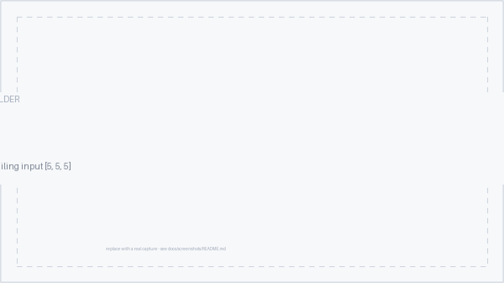

# AI Code Breaker

Differential testing for Python functions — find inputs where a candidate implementation and a known-correct reference disagree, then minimize and explain the failure.

## Demo link:

Access the live demo at [your-demo-url.com](https://your-demo-url.com) _(replace with your deployed URL — the app also runs locally, see [Setup](#setup))_

## Table of Content:

- [About The App](#about-the-app)
- [Screenshots](#screenshots)
- [Technologies](#technologies)
- [Setup](#setup)
- [Approach](#approach)
- [Status](#status)
- [Credits](#credits)
- [License](#license)

## About The App

**AI Code Breaker** is a tool that finds bugs in your code by comparison. You give it a description of what a program/feature should do, a candidate Python implementation, and a known-correct reference implementation. It then generates test inputs, runs both implementations in separate environments, and finds specific inputs that make the two implementations behave differently, then simplifies each failing case to the smallest example and explains what went wrong.

API Key (Optional)

You don't need an API key to use AI Code Breaker. It finds bugs by running your code and comparing the results — no AI needed for that part. It comes up with test inputs on its own, spots where the two versions disagree, and shrinks each bug down to the smallest example that breaks.

Adding an Anthropic API key just activates two extra features: Claude can suggest more test inputs, and it can explain each bug in plain English. Without a key, you still get everything else, plus simpler built-in explanations.

## Screenshots

More screenshots — the submission form, staged progress, results overview, all-tests table, AI explanation, and a benchmark run — live in [`docs/screenshots/`](docs/screenshots/).

## Technologies

I used `Python`, `FastAPI`, `SQLAlchemy`, `PostgreSQL`, `Redis`, `RQ`, `Hypothesis`, `Docker`, `Next.js`, `React`, `TypeScript`, and `Tailwind`, ...

## Setup

- download or clone the repository
- copy the env file: run `cp .env.example .env` (add an optional `ANTHROPIC_API_KEY`)
- start everything: run `docker compose -f infra/docker-compose.yml up --build`
- check it's up: `docker compose -f infra/docker-compose.yml ps` (api + worker should be `Up`)
- open the frontend at `http://localhost:3000` and the API at `http://localhost:8000`
- ...

Prefer running the pieces directly? `pip install -r requirements.txt && alembic upgrade head && uvicorn app.main:app --reload` for the backend, `npm install && npm run dev` for the frontend. More details in [`DEPLOYMENT.md`](DEPLOYMENT.md)._

## Approach

I built this backend-first, based on one rule: the AI never decides if code is correct — only running it does.

I kept the backend organized in layers, where each part has one job (handling requests, running the logic, saving to the database). This makes it easier to test and change one piece without breaking the rest.

For code style, I kept functions small and focused, added clear labels to catch mistakes early, and double-checked anything coming from outside — user input, AI output, and code results — before trusting it.

## Status

**AI Code Breaker** is still in progress. `Version 2` will wire the property-search and minimization stages fully into the async pipeline and close the mutation / state-leakage detection gaps.

## Credits

List of contributors:

- [Your Name](https://github.com/your-handle)
- [Anthropic Claude](https://www.anthropic.com) — AI test proposals and explanations
- [Hypothesis](https://hypothesis.readthedocs.io) — property-based test generation and shrinking

## License

MIT license @ [author](https://github.com/your-handle)

---

**Final Words:**

Thank you for staying with me up to this point. Suggestions and feedback are always welcome. 😃
